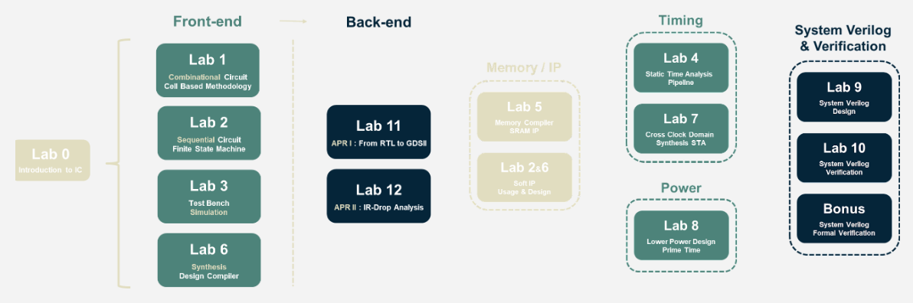

# NYCU ICLAB writeup
This repository is used to practice the labs from Prof. Chen-Yi Lee's IC Design Lab (ICLab) course (2021 Fall) at NYCU.

## Practices
* Lab01 - Simulation flow : [[spec](./Practices/Lab01_Practice.pdf)] [[design](./Practices/CORE.v)]

## Labs
* Lab01 - Supper MOSFET Calculator (SMC) : [[spec](./Labs/Lab01/Lab01_Exercise_2021_fall.pdf)] [[design](./Labs/Lab01/SMC.v)]
* Lab02 - String Match Engine (SME) : [spec]
* Lab03: Sudoku (SD)
* Lab04: Artificial Neural Network (NN)
* Lab05: Matrix Computation (MC)
* Lab06: CheckSum (CS)
* Lab07: Polish Notation (PN)
* Lab08: Series Processiong (SP)
* Lab09: Happy Farm (HF)
* Lab10: Coverage of Lab09 Happy Farm (HF)
* Lab Bonus: Formal Verification
* Lab11: Matrix Computation (MC)
* Lab12: Artificial Neural Network APRII

## Reference
* 2021-Fall IC Design Lab (ICLAB) : [link](https://www.lhlaib.com/course/2021-fall-iclab)